```{r setup, include=FALSE}
knitr::opts_chunk$set(echo = TRUE)
```

# 1. Original Visualization

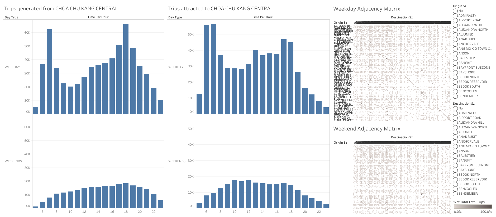

The data visualisation above is created by the following 2 datasets:

* *origin_destination_bus_SZ_202201.csv*, this data set was downloaded from LTA Datamall and URA region, planning area and planning subzone information were added by using GIS Overlay operation.

* *MP14_SUBZONE_WEB_PL*, this data provides URA Master Plan 2014 Planning Subzone boundary map in ESRI shapefile format. It was downloaded from data.gov.sg.

# 2. Critique of original visualization 

## 2.1 Clarity 

* The visualization lacks dashboard title and a brief description of what this dashboard is about, users have difficulty understanding the context and purpose of this visualization thus may undermine the effectiveness of messages conveyed. For example, it is not clear what is the trips referring to unless the user looks at the data set to know that it is bus flows. Moreover, the chart titles are unclear to the user, for example "Weekday ajacency Matrix" is a term that is not friendly to users without statistical background and hence one may ignore this part.

* The axis labels are unclear to the user. For example, in the bar charts, there is no unit for the values, users cannot tell what does the y-axis numbers trying to show, more clarity should be added to show it is the "number of trips". Moreover, the x axis "Time Per Hour" may be potentially misleading as some users may misunderstand it as how many times per hour the values are related to the trips instead of the time, i.e. from 1am to 12am. The label can be better phrased to be commonly understandable. 

* The abbreviations used for the charts and labels are inappropriate. For the adjacency matrix axis and the legend labels, "Destination Sz" and "Origin Sz" are used, it is impossible for the user to know what does "Sz" referring to. For uncommon abbreviations, it is more recommended to use full term. 

* The adjacency matrix is compressed in size with rows and column names overlapping with each other and there is no column names shown for the weekend chart under "Origin Sz". With existing adjacency matrix, users have difficulty locating each point on the chart for further exploration. It does not provide useful information by simply looking at the chart either. 

* the y-axis column name for the charts is not fully shown, only "Weekends" was visible instead of "Weekends/holiday". This may lead users to mistaken the values for only weekends. 

* The data cleaning was not completely done as there are null values for both destination and origin subzones. 

## 2.2 Aesthetics

* The size of adjacency matrix is too small to be readable. Despite the chart being interactive, it is hard for the user to hover to the desired point for further analysis. Moreover, the patterns of the matrix is impaired by the small figure size and hence cannot tell if there is a color difference used for visualization purpose. The users are unable to use the aesthetics of the matrix to understand the distribution and intensity of the bus flows between subzones. 

* The dashboard space is not fully utilized. There are 4 bar charts separating weekend and weekdays by different subzones where they could be potentially reduced to 1 per subzone. The adjacency matrix on the other hand could be rearranged to be significantly larger. 

* Separate charts were used to display weekday and weekend bus distributions, making it difficulty for users to see the comparison between the day types. In fact, weekday and weekend distributions can be combined into a single chart so that users do not have to hover and compare especially there are more than 10 columns for "Time Per Hour", it will easily lead to interpretation error. 

* The y-axis values for bar charts are not synchronized across, for example on the Origin subzone the units are in millions but on Destination subzone the units are in thousands. This will undermine the accuracy for the users to make comparisons. 

## 2.3 Interactivity

* Filters are not linked to each other hence not maximizing the interactivity provided by dashboard actions. Current filters are rigid in a way that origin and destination subzones are filtered separately. It does not reflect in depth information, for example where are the destinations of the origin bus trips. Users have to manually select them. 

* Tool tips were included but it only shows information that can be interpreted on the charts themselves, additional information could be embedded so that users can hover over a mark to examine the details-on-demand. 

* When selecting a highlight on the chart, there is no interactivity among the charts, highlighting function is not fully utilized. 

# 3. Proposed design 

## 3.1 Design sketch 

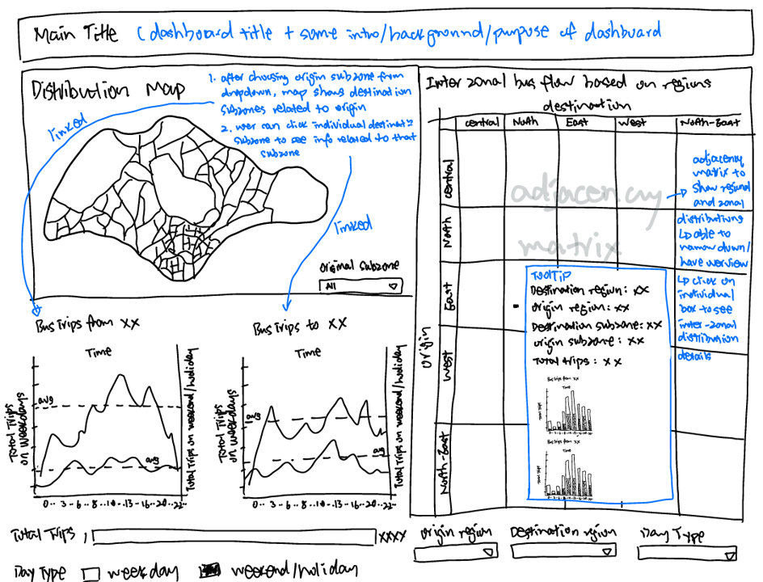

## 3.2 Advantages of proposed design 

* A distribution map was embedded into the dashboard as one of the main visualization. It provides a intra-zonal analytics for bus flows in singapore. Users are able to select the orgin subzone from the map, and it will show all the corresponding destination subzones related, Moreover, the color intensity of different destination subzones will give the user an overview of the subzones with most bus trips and least bus trips. 

* Line charts are linked with distribution map. For example, when user selects origin subzone in the map, "Bus trips from Admiralty" chart will show the total distribution from Admiralty. Subsequently when the user dive into the different corresponding destination subzones, for instance Changi Airport, the "Bus trips to Changi airport" line chart will show the distribution of bus frequencies from Admiralty to Changi Airport. 

* The line charts shows the average number of trips for both weekday and weekend/holiday. This allows users to know at which time slots are the peak hours related to a subzone. 

* Line charts combines weekday and weekend/holiday bus flows into a single chart, allowing better comparisons 

* The adjacency matrix allows selection on regions on top of the subzones, providing users an option to either analyze at a overall level, or drill down to region and subzone levels. This allows inter-zonal analysis based on regions. Color intensity was improved. 

* Destination and origin subzone labels are included in the tool tips of adjacency matrix instead of showing them on the axis that will cause overlaps in display. Tool tips includes details on destination region and subzone, origin region and subzone, total number of trips, as well as frequency bar charts of both destination and orgin by day type, allowing users to have in-depth analysis on a selected mark. 

* Filters are changed to dropdown selections, allowing more space for visualization. 

* Instructions of interactivity are included besides the chart titles 

# 4. Data visualization steps 

## 4.1 Data preparation 

Step    | Description             | Screenshot
--------|-------------------------|-------------------------
1 | Open Tableau Desktop, drag and drop ‘origin_destination_bus__SZ_202201.csv’ and ‘MP14_SUBZONE_WEB_PL.shp’ into the workbook pane | 
2 | Drag ‘MP14_SUBZONE_WEB_PL.shp’ under “Files” to the right working pane to connect with the ‘origin_destination_bus__SZ_202201.csv’. Then configure the relation between ‘MP14_SUBZONE_WEB_PL’ and ‘origin_destination_bus__SZ_202201’ by selecting ‘Origin Sz’ ‘Destination Sz’ columns from ‘origin_destination_bus__SZ_202201’ and ‘Subzone N’ column from ‘MP14_SUBZONE_WEB_PL’. | 
3 | At the right top corner of “Data Source” page, click “Add” to create 2 data filters: ‘Destination Sz’ and ‘Origin Sz’. For each filter edition, uncheck “Null” to exclude all the blank values in the dataset. | 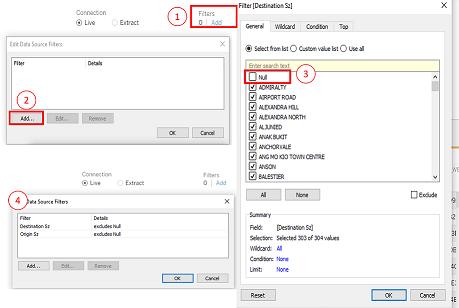
4 | Under the columns of ‘origin_destination_bus__SZ_202201’, double click on “Time Per Hour” “Origin Sz” and “Destination Sz” respectively and change them to “Time(24h)”, “Origin Subzone” and “Destination Subzone”. | 
5 | Create a new worksheet, name it “map”, on the left side “Data” panel, right click on “Time(24)” and choose “Convert to Dimesion” | 

## 4.2 Data visualization 

### 4.2.1 Plotting map

Step    | Description             | Screenshot
--------|-------------------------|-------------------------
1 | On the “map” worksheet, drag and drop “Geometry” under “Tables” on the Data panel to the working pane to show the Singapore map, “Longtitude(generated)” and “Latitude(generated)” will automatically be on the “Columns” and “Rows” shelf on top. Next, drag “Total Trips” to “Color”, and “Destination Subzone” and “Origin Subzone” both to “Detail” under “Marks” shelf| 
2 | Drag and drop “Origin Subzone” to “Filters” shelf, select all the subzones then click “Ok”. Click on the dropdown for “Orgin Subzone” and select “Show Filter”. Lastly, on the right side pane of the worksheet, select the dropdown for “Orgin Subzone” and choose “Single Value(list)” | 
3 | Under “Marks” shelf, click on “Color” to “Edit Colors”, select “Blue” under “Palette” dropdown list and click “ok”| 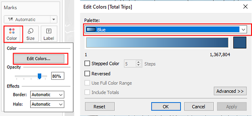
4 |Double click on the worksheet title to “Edit Title”, change the font, font size and font color | 

### 4.2.2 Plotting line charts 
Step    | Description             | Screenshot
--------|-------------------------|-------------------------
1 | Create a new worksheet named “Origin”. Drag and drop “Day Type” into “Color” and “Origin Subzone” into “Detail” under Marks shelf. Drag and drop “Time(24h)” to “Columns” shelf and 2 times “Total Trips” to “Rows” shelf to create the bar chart| 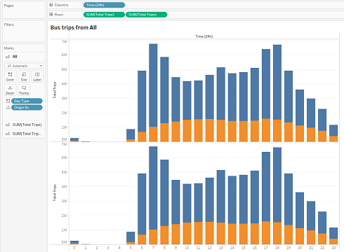
2 | Drag and drop “Origin Subzone” and into “Filters” shelf and select “All” under respective filters. For “Origin Subzone”, click on the dropdown and select “Show Filter”, then go the right-side panel, click on the dropdown for “Origin Subzone” and select “Single Value (list)” | 
3 | Double click on the worksheet title to “Edit Title”, change the font, font size and font color. Click on “Insert” and select “Origin Subzone” to the text body so that subzone name will change according to filter selection | 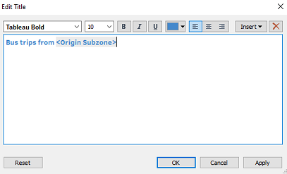
4 | For the second “SUM(Total Trips)” click on the dropdown and select “Dual Axis” | 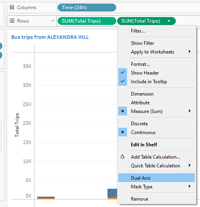
5 | double click on each of the sum variable and change the condition as shown to create charts for weekday and weekends/holiday respectively | 
6 | on the “Marks” shelf, choose “Line” for each of the charts | 
7 | for each of the axis, right click and select “Add Reference Line” | 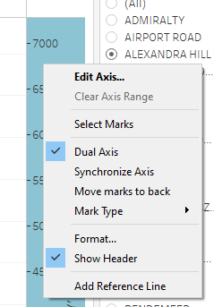 
8 | for each axis, add an average line and change the formatting of the lines as shown | 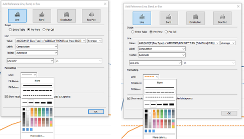 
9 | for each axis, rename them according to day type | 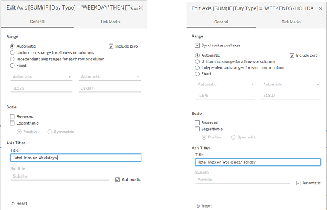
10 | on the right y-axis, right click and choose “Synchronize Axis” | 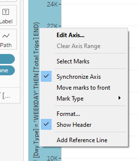
11 | click on "Tooltip" under "Marks“ to edit the tool tip titles, change calculation field names to "Total Trips" | 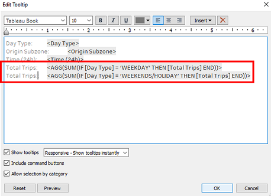
12 | At the bottom of the working pane, Ctrl select “Origin” sheet and click on “Duplicate” to create another worksheet named “Destination”, then click on the title to edit the title by clicking “Insert” >”Destination Subzone”| 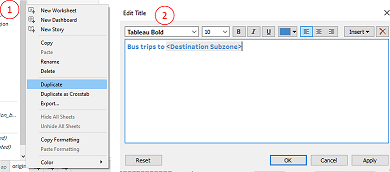
13 | Drag and drop “Destination Subzone” into “Filters” shelf and select “. Then click on the dropdown and select “Show Filter”, then go the right-side panel, click on the dropdown for “Destination Subzone” and select “Single Value (list)” | 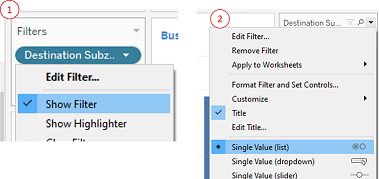


### 4.2.3 Plotting bar charts

Step    | Description             | Screenshot
--------|-------------------------|-------------------------
1 | Create a new worksheet named “Origin(2)”. Drag and drop “Day Type” into “Color” and “Origin Subzone” into “Detail” under Marks shelf. Drag and drop “Time(24h)” to “Columns” shelf and “Total Trips” to “Rows” shelf to create the bar chart| 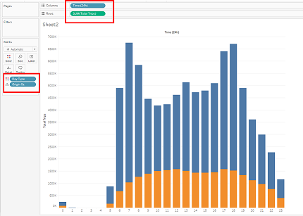
2 | Drag and drop “Origin Subzone” and “Origin Region” into “Filters” shelf and select “All” under respective filters. For “Origin Subzone”, click on the respective dropdown and select “Show Filter”, then go the right-side panel, click on the dropdown for “Origin Subzone” and select “Single Value (list)” | 
3 | Double click on the worksheet title to “Edit Title”, change the font, font size and font color. Click on “Insert” and select “Origin Subzone” to the text body so that subzone name will change according to filter selection |
4 | At the bottom of the working pane, Ctrl select “Origin(2)” sheet and click on “Duplicate” to create another worksheet named “Destination(2)”, then click on the title to edit the title by clicking “Insert” >”Destination Subzone” | 
5 |Drag and drop “Destination Subzone” into “Filters” shelf and select “. Then click on the dropdown and select “Show Filter”, then go the right-side panel, click on the dropdown for “Destination Subzone” and select “Single Value (list)” | 

### 4.2.4 Plotting adjacency matrix

Step    | Description             | Screenshot
--------|-------------------------|-------------------------
1 | Create a new worksheet named “adjacency”, drag and drop “Origin Region” and “Origin Subzone” under “Rows”,  “Destination Region” and “Destination Subzone” under “Columns”, and “Total Trips” into “Color” under “Marks” shelf to generate the adjacency matrix. |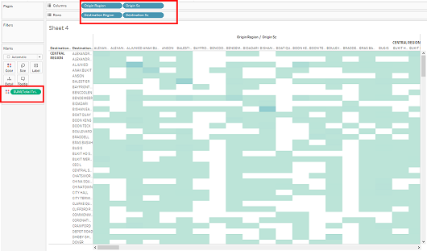
2 | Drag and drop “Origin Region” under “Filters” shelf, select “All” and click on the dropdown arrow to select “Show Filter”. Repeat for “Destination Region” and “Day Type”| 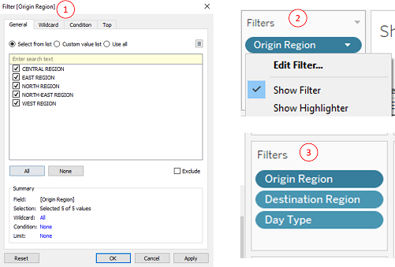
3 | Under “Marks” shelf, click on “Color” to “Edit Colors”, select “Blue” under “Palette” dropdown list and click “ok” | 
4 | Double click on the worksheet title to “Edit Title”, change the font, font size and font color. | 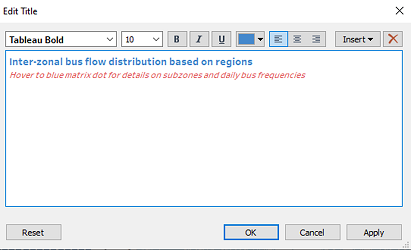
5 | Right click on the y axis and select “Rotate Label”, the right click again to deselect “Show Header” to hide all the overlapping labels| 
6 | On the top of the working panel, click on the dropdown list to select the “Entire View” for the adjacency matrix | 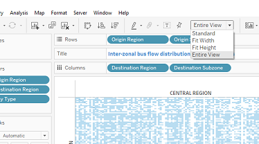
7 | At the bottom of the working pane, Ctrl select both “Origin” and “Destination”, right click and select “Duplicate” to create another 2 worksheets that will be used for dashboard tooltips. | 
8 | In the “adjacency” worksheet, select “Tooltip” under “Marks” shelf, edit the text body as shown in the screenshot. For title names, choose the relative data field under “Insert” so that it will change according to filter selection. To include the bar charts of “Origin” and “Destination” in the tooltip, click “Insert” >”Sheets“ to select the respective Sheets, which are “Origin(2)” and “Destination(2)” | 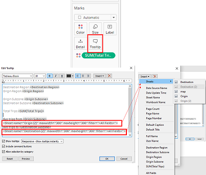

### 4.2.5 Creating dashboard

Step    | Description             | Screenshot
--------|-------------------------|-------------------------
1 | Create a new dashboard from the bottom panel. Drag the respective worksheets from the “Sheets” shelf into the dashboard pane with the desired positions as shown | 
2 | Arrange the filters and consolidate them to the bottom of the dashboard |  
3 | For each filter, click on the dropdown selection, select “Multiple values (dropdown)” for “Origin Region”, “Destination Region” and “Day Type”, select “Single Value (dropdown)” for “Origin Subzone”| 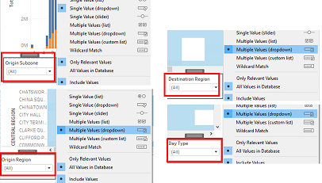
4 | Drag and drop “Text” under “Objects” shelf to the dashboard pane, one at the top for dashboard header and one at the bottom for web links | 
5 | For each of the textbox inserted, double click to “Edit Text” to include the necessary text body and change font size, font, and font color as shown | 
6 | Under “Objects”, choose “Floating” then drag “Text” to the “Distribution Map” segment, double click on the text box to edit the text body | 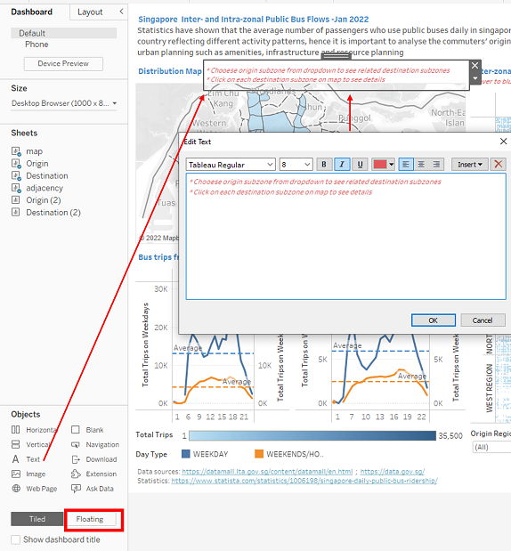
7 | For “Origin Subzone” filter, click on the dropdown besides it and select “Floating” then place it inside the “Distribution Map” | 

### 4.2.6 Configure related charts

Step    | Description             | Screenshot
--------|-------------------------|-------------------------
1 |Go to “map” worksheet, on the right panel click on the dropdown besides “Origin Subzone”, select “Apply to Worksheets”>”Selected Worksheets”. Then check “Origin” and "Destination" then click “Ok”, so that the filter for Origin and Destination  barchart will be linked with the map | 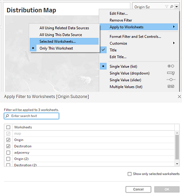 
2 | Go to the dashboard, click on the “Distribution Map”, choose the “Filter” icon on the right to set the map as a filter| 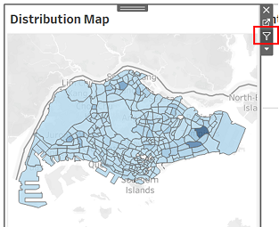 
3| On top of the working pane, click on “Dashboard” and select “Actions”. Under “Edit Filter Action”, check “map” for “Source Sheets”, check “map” and “destination” for “Target Sheets” |  


# 5. Conclusion and insights 

## 5.1 Final data visualization 

The final data visualization is shown below, it is also available at [Tableau Public](https://public.tableau.com/app/profile/xiaoqi.min/viz/DataViz2_16482587836840/Dashboard1)


## 5.2 Insights 

* From Inter-zonal bus flow distribution chart (adjacency matrix), inter-zonal bus trips are more densely populated within the same region.


There are significantly fewer bus trips from a subzone travelling to other subzones in another region. There are more inter-zonal interactions between bus trips from central region and North East region to the rest of the regions, but bus trips in other regions mainly interact within its own region. 

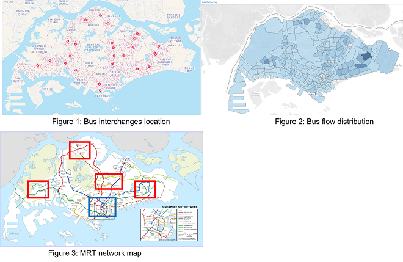

* From the distribution map, darker colored subzones with high number of total bus trips, for example Tampines, Bedok, Aljunid, Toa Payoh Central, Bishan East, Serangoon Central, Woodland East and Jurong West Central, are locations near bus interchanges as seen from [Figure 1](https://busrouter.sg/). Bus interchanges will have higher frequencies of bus flows than subzones with mainly neighborhood. 

* On the other hand, the darker colored subzones with high number of total bus trips are those areas with very few MRT stations around them, as seen from the red boxes in [Figure 3](https://mrt.sg/map), whereas in the blue box which is the CBD area with multiple MRT stations and lines, the bus trip distribution is not as intense. Bus becomes a more accessble vehicle when it comes to remote areas that MRT is not less available. 

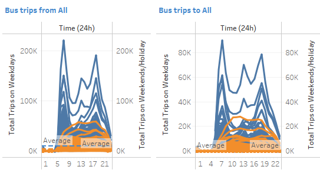

* For intra-zonal bus flows, the peak hours during weekdays are from 6-8am and 5-6pm, while bus flows during weekends and holidays are more evenly distributed across a day. Weekday peak hours are attributed to working and school hours. From the line charts, each subzone still have more time slots that have above average bus flows, hence there is a need to implement more measures to ease the peak hours. 
