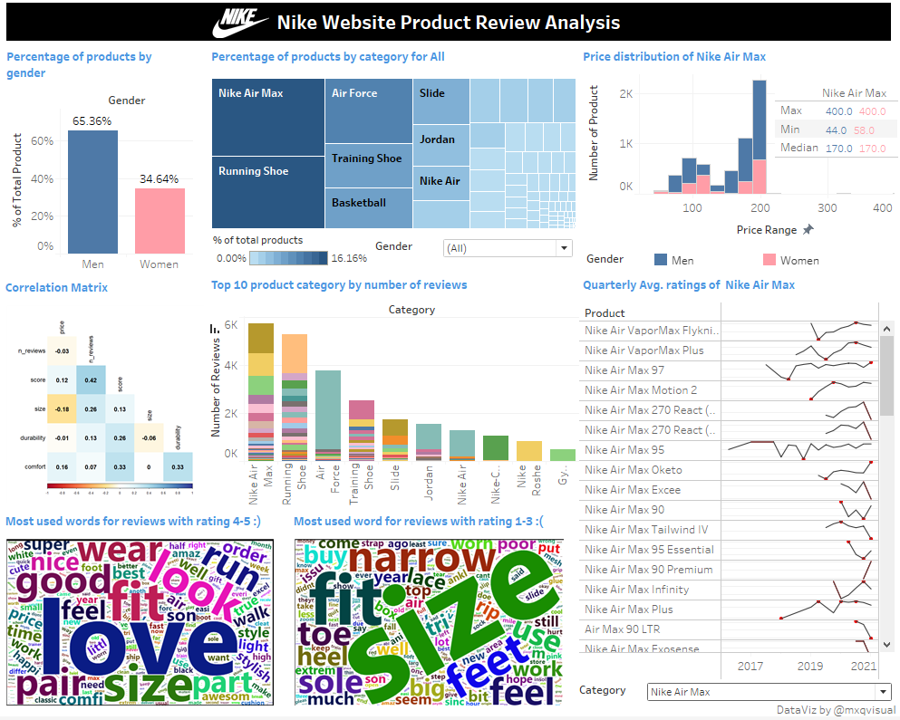
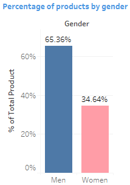
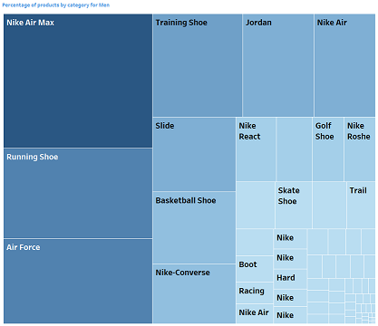
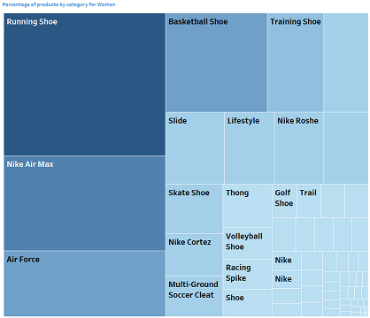
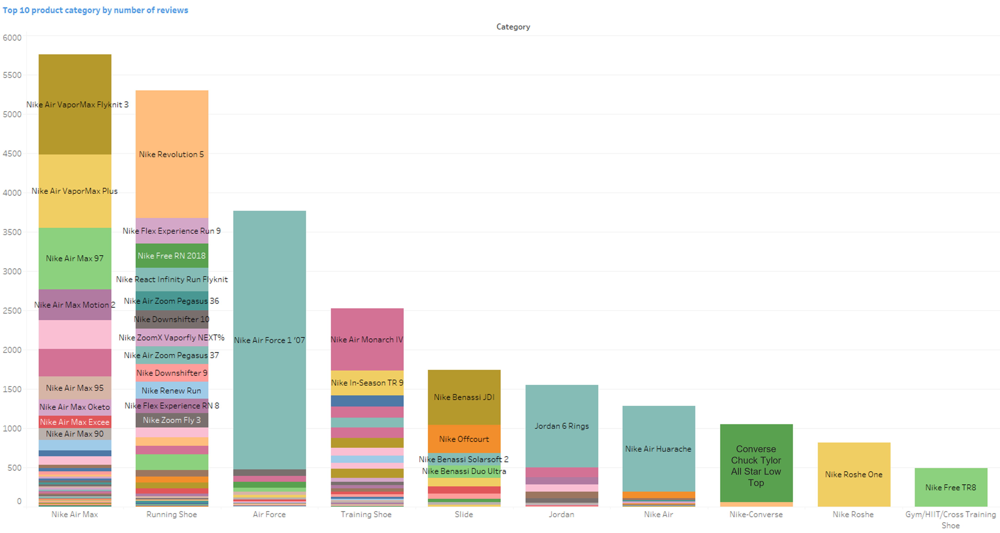
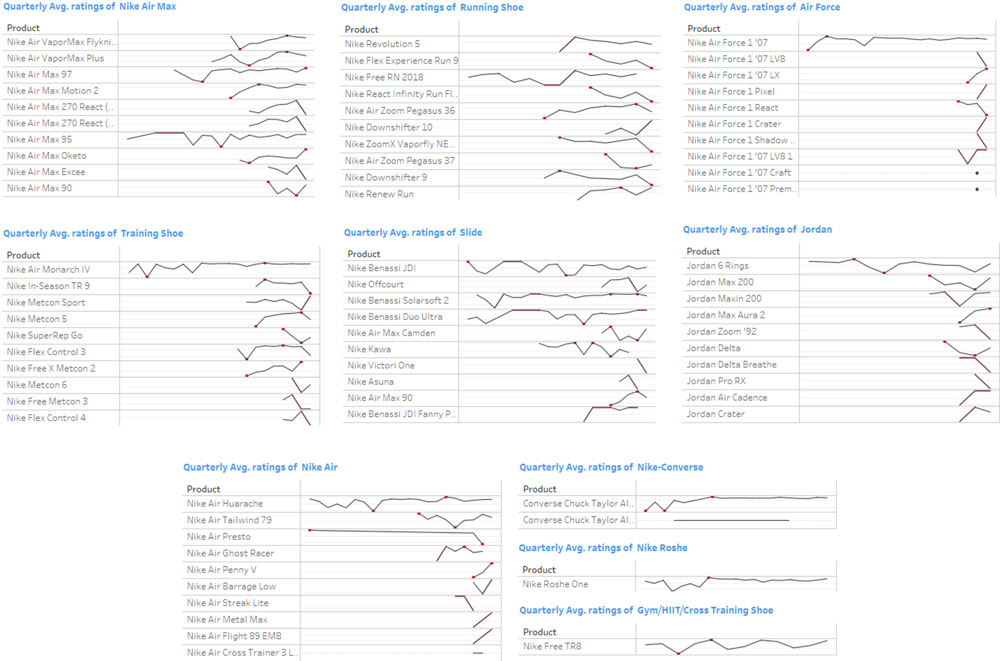
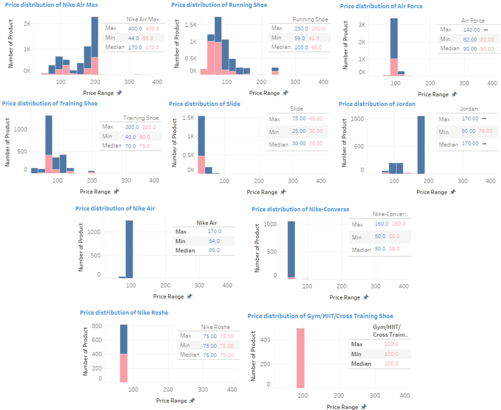
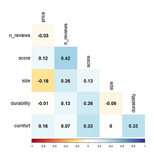
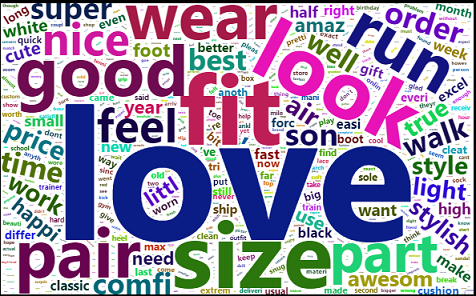
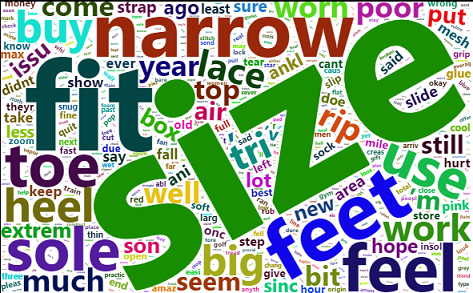

```{r setup, include=FALSE}
knitr::opts_chunk$set(echo = TRUE)
```

# Introduction 

Nike has built one of the world's most influential brand names, especially in footwear. Its advertising slogans such as "Just Do It" and "There Is No Finish Line" have become powerful marketing tool that helped it to be the champion of brand builder. 

For this project, I will be analyzing Nike's shoe products from the perspective of marketing and product improvements to further push Nike's potential for higher performance. 

# The Data 

The data is sourced from [GitHub](https://github.com/DanEllen/Nike-Shoes-Web-Scrape-and-Analysis) where the author scrapped information directly from Nike's official website. There are 2 raw datasets separated by gender, which has 23,524 rows of men's data and 12,433 rows of women's data. Each data set contains 17 data fields: ID, gender, product title, product URL, product category, price, descrption, number of reviews, average rating for produc reviews, average score for reviews input by users based on size, comfort, and durability, individual review's title, score, body and date. 

# The Approach

For the purpose of this project, data cleaning was done via Microsoft Excel: 

* Two raw data sets were joined together 

* Original product "title" was changed to "Product"

* Noticed that under "Category" field, there are values such as "Men's Shoes", "Shoe", "Woman's Shoes" which do not belong to specific category based on functions. These rows are filtered out to re-categorize them based on their collections or series, such as "Nike Air", ”Nike Zoom", "Jordan" etc. In addition, categories with "custom" series are grouped to form "Custom Shoe" category. Finally, gender specific names in "category" such as "Men's Basketball Shoe" and "Woman's Basketball Shoe" are changed to "Basketball Shoe" to synchronize product category. 

For data visualization, a combination of R and Tableau was used for different visualization techniques to achieve the final dashboard and represented in Tableau Dashboard format. Below explains 2 visualizations that were done via RStudio: 

* Correlation Matrix was done using *corrplot*. 

A new data frame was created using the attributes that needs to be included in correlation matrix, namely price, number of reviews, score, size, durability, and comfort. 

The objective of correlation matrix is to reveal potential correlations among the attributes, especially if there exists impact by the user's comments on size, comfort and durability on the product's score. 

* Text analysis was done using *wordcloud2*, *tm*,*SnowballC*, *readr*, *dplyr*, and *mlbench*. 

From the dataset, review title and review body were combined into a single data field. For this section, there are 2 visualizations to be built, one for reviews that have high ratings (ratings 4-5), and another for reviews that have low ratings (ratings 1-3). For each of visualization, *r_rating* column was first filtered and the rest of the steps were then carried out: 

The data frame was converted into a corpus for preprocessing.A corpus is a collection of documents. For pre-processing of text, *tm_map* function was used to convert texts to lower cases, removing punctuations and stopwords, eliminating extra white spaces and stemming which reduces the words to their root form. 

Then the texts are extracted by word frequencies to be used as tags for building the word cloud. And finally *wordcloud2* package was used to generate the final visualization. 

# Data Visualization Dashboard

The final interactive data visualization is shown below, it is also available at [Tableau Public](https://public.tableau.com/app/profile/xiaoqi.min/viz/nikeviz_16495108978330/Dashboard1)



# 1.0 Product Distribution 

<center>


</center>

For all the products offered in Nike's website, there are more products for men (66.36%) as compared to women (34.64%)

<center>


</center>

<center>


</center>

By examine the percentage of products by category, we can see that running shoe, Nike Air Max, Air Force, basketball shoe and Training shoe are the common categories that accounts for high proportion of products offered for both men and women. These includes signature collections of Nike such as Air Force, and sports specific shoes such as running and basketball shoes. 

For products offered to men, Jordan and Nike Air collections are the outstanding categories that holds a large proportion of total products. We can see that for men's products, the categories are more catered towards non-functioning shoes which are not for a specific sport. Series such as Air Max, Air Force, Jordan, and Nike-Converse are offer products that are mostly stylish and aesthetically appealing. There are wide varieties of designs and products for each of these categories to attract consumers.  

As compared to men, products offered to women are more functioning shoes. From the treemap, we can see that the bulk of the products are for running, training and basketball.

These could potentially due to the nature of gender and the choices of apparel. Women have more choices of shoes other than sports shoes, such as flats, heels, boots, sandals, pumps and so on. For males, they generally prefer comfort and stylish shoes to be daily choices of outfit. Hence, men could demand more from Nike's products other than it being a sports shoe brand. 


From the top 10 product categories by number of reviews, we can see that these are the classic collections and products offered by Nike. Among all, Air Max tops the number of reviews. Under Air Max, VaporMax Flyknit 3, VaporMax Plus and Air Max 97 received the most number of customer reviews. 

Other popular products are Nike Revolution 5, Air Force 1 '07, Nike Air Monarch IV, Nike Benassi JDI, Jordan 6 Rings, Nike Air Huarache, Converse Chuck Taylor All Star Low Top, Nike Roshe One, and Nike Free TR8. 

The high number of reviews is a two sided sward, it can mean the product is popular or there needs to be improvements. We will proceed to look at the quaterly average ratings of these top product categories. 

# 2.0 Average Product Ratings


Products such as VaporMax Flyknit 3, VaporMax Plus, Jordan 6 Rings, and Nike Free TR8 had a overall good rating trend since their launch, with average ratings above 4.4. Below are some of the notable products: 

* Air Max 97 falls below rating 4 in Q2 2018

* Revolution 5 has kept its ratings above 4 but the performance in recent quarters are decreasing. 

* After 2 troughs in 2016 and 2017 respectively, the performance of Nike Air Monarch IV stabilized at high ratings of above 4.5 in recent quarters. Similar to it, Nike Air Huarache experienced the same trend. after unstable average ratings and a trough at 4.0 on 2017, it stabilized performance at high ratings of above 4.6 afterwards. 

* The average ratings of Nike Benassi JDI seems to be unstable from its launch, ranging from as low as 3.8 to as high as 5.0. This implies different customer demand may not be met. 

* Converse Chuck Taylor All Star Low Top started with very low average ratings such as 1.0 and 3.3. However, there were improvements in its performance starting from 2018 Q1 and it kept the good average ratings of 4.4 and above till today.

* Nike Roshe One launched with a good rating but experienced a trough at 2017, then recovered and stabilized the performance from 2017 Q4 onwards. 

# 3.0 Price Distribution



From the price distribution of the top product categories, we can see that for most of the categories, the median price between men and women are almost the same, except for Running shoe which the median price deviation is around 50%. Men's running shoe median price is approximately double of women's. 

For products that are for a particular sport or activity, such as running shoe, training shoe, slide, and Gym/HIIT/Cross Training Shoe, the prices are interestingly lower, raning around 100 dollars or below. However, the prices of Air Max, Air Force, Jordan which are more of aesthetic and stylish shoes has significantly higher prices than functioning shoes. Air Max's maximum price could reach as high as 400 dollars. 

# 4.0 Correlation Matrix

<center>


</center>

This chart shows the correlation between the measurable data fields. The numbers represent the strength of the correlation between two variables. As we can see from the chart, number of reviews has high positive correlation with score. This implies that the number of reviews have a direct positive impact on the scoring of the product or vice versa. Hence, it is an important marketing area to strategize as customers nowadays turn to online reviews before they purchase a product for reassurance and decision making. Ensuring positive reviews and ratings will value add to marketing and revenue as it increases consumer trust and customer experience. The number of reviews matters too, as pointed out by a study from [Stanford University](https://www.axios.com/with-amazon-reviews-quantity-draws-more-buyers-than-quality-1513305106-d25e321f-26b3-4406-a28b-fc24a57e2c12.html) that people prefer products with more reviews than the competitors, despite the competitors gained a higher average score.

The 3 user inputs on their experiences on size, durabilit and comfort reveals that comfort and durability have high positive impact on the scoring of the product. They value comfortability and the lastingness of shoes which the product development team could take note of. 

# 5.0 Text Analysis 

Text mining of the reviews will help us gain a direct understanding of the key words from customer experiences and demand. Thus, helping us to improve marketing strategy and product development. 

<center>


</center>

From the key words given by positive reviews (review ratings between 4-5), we can see that majority of customers were happy with their products received, leaving positive words such as love, good, and nice. 

From the word cloud, we can also gather information about what customers like about the products. Key words such as size, fit, look, wear, style implies that customers place heavy emphasize on the shoe's comfortability and aesthetics. 

Another interesting finding are the words "son" and "gift". They are the frequent words just after customer experience, which indicates a potential marketing strategy. We can imply that there is a bulk of customers buying shoe products for their beloved ones. Hence, one strategy is to look into how to improve customers' experience when they received a product as a gift. Areas such as packaging, delivery options, customization could be potential value add. 

<center>


</center>

From the key words given by negative reviews (review ratings between 1-3), we can see that comfortability is again the most valued aspect of customer experience. Size and fitting are areas of improvement that product development team can reflect on. Market research on how and why certain products will have these fitting problems should be carried out as a issue to tackle. Moreover, specific part of the shoe, such as toe, heel, sole and lace are the top words that appear in the negative review. This implies that more work should be done on improving wearing experience, this could be from product designing, usage of materials and possible adoption of new technologies perspectives.

# Conclusion

From this analysis project, several insights were gained regarding the products offered by gender, what are the popular product categories, how they performed over the years and their price distributions. Also, the reviews from customers had given us insights on what criteria do they demand for a product to be qualified as a good product. 

Online reviews are direct reflection of customer satisfaction and they can be useful when making marketing and product development decisions. For future work, industry-level information could be included to compare Nike's performance with the industry standard. Moreover, analyzing other market competitors will be useful to gain objective understanding of Nike's strentgh and weaknesses. 